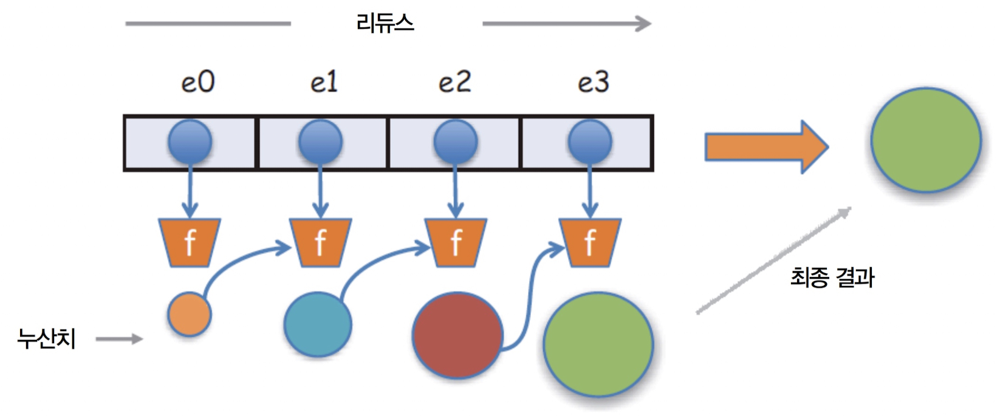

# 함수 체이닝

프로그램이 정답에 이르기까지 거치는 경로를 제어 흐름이라고 한다. 명령형 프로그램은 작업 수행에 필요한 전 단계를 노출하여 흐름이나 경로를 아주 자세히 서술한다. 예를 들면 다음과 같다.

``` javascript
// javascript
let loop = optC();
while (loop) {
  const condition = optA();
  if (condition) {
    optB1();
  } else {
    optB2();
  }
  loop = optC();
}
optD();
```

``` python
# python
loop = opt_c()
while loop:
    condition = opt_a()
    if condition:
        opt_b1()
    else:
        opt_b2()
    loop = opt_c()
opt_d()
```

그러나 함수형 프로그래밍 관점에서 이러한 연산을 서술하면 다음과 같이 서술할 수 있다.

``` javascript
// javascript
optA().optB().optC().optD();
```

``` python
# python
opt_a().opt_b().opt_c().opt_d()
```

이러한 함수 체이닝을 메서드에 잘 적용한 예가 바로 문자열이다.
문자열을 다음과 같이 사용할 수 있다.

``` javascript
// javascript
'Functional Programming'.substring(0, 10).toLowerCase() + ' is fun';
```

``` python
# python
'Functional Programming'[0:10].lower() + ' is fun'
```

---

객체지향 프로그램은 주로 상속을 통해 코드를 재사용한다.

그러나 함수형 프로그래밍은 접근 방법이 다르다. 자료구조를 새로 만들어 어떤 요건을 충족시키는 게 아니라 배열 등의 흔한 자료구조를 이용해 다수의 굵게 나뉜 고계 연산을 적용한다. 이러한 고계 연산으로 다음과 같은 일을 한다.
- 작업을 수행하기 위해 무슨 일을 해야 하는지 기술된 함수를 인수로 받는다.
- 임시 변수의 값을 계속 바꾸면서 부수효과를 일으키는 기존 수동 루프를 대체한다.

---

## map: 데이터를 변환


`map`은 원소를 모두 변환해서 새롭게 만들어 반환한다.

``` javascript
// javascript

// IP
const result = [];
const persons = [p1, p2, p3, p4];
for (let i = 0; i  persons.length; i++) {
  const p = persons[i];
  result.push(p.fullname);
}

// FP
const result = [p1, p2, p3, p4].map((person) => person.fullname);
```

``` python
# python

# IP
result = []
persons = [p1, p2, p3, p4]
for i in range(len(persons)):
    p = persons[i]
    result.append(p.fullname)

# FP
import pydash
result = pydash.map_([p1, p2, p3, p4], lambda person: person.fullname)
```

## reduce: 결과를 수집


데이터를 변환한 후에 의미 있는 결과를 도출할 때에는 `reduce`를 사용한다. `reduce`는 원소 배열을 하나의 값으로 짜내는 고계함수다. 원소마다 함수를 실행한 결과값의 누적치를 계산한다.

``` javascript
// javascript

// IP
const result = {};
const persons = [p1, p2, p3, p4];
for (let i = 0; i < persons.length; i++) {
  const country = persons[i].address.country;
  result[country] = result[country] == null ? 1 : result[country] + 1;
}

// FP
const _ = require('lodash');

const result = _([p1, p2, p3, p4]).reduce((stat, person) => {
  const country = person.address.country;
  stat[country] = _.isUndefined(stat[country]) ? 1 : stat[country] + 1;
  return stat;
}, {});
```

``` python
# python

# IP
result = {}
persons = [p1, p2, p3, p4]
for person in persons:
    country = person.address.country
    result[country] = 1 if not country in result else result[country] + 1

# FP
import pydash
import toolz as tz

persons = pydash.map_([p1, p2, p3, p4], lambda person: person.address.country)
result = tz.frequencies(persons) # 파이썬의 경우에는 다음과 같이 원소의 갯수를 세어주는 함수가 있다.
```

## filter: 원하지 않는 원소를 제거


`if-else` 문을 남발하는 대신 `filter`를 사용하면 한결 코드가 깔끔해진다.

``` javascript
// javascript

// IP
let result = '';
const persons = [p1, p2, p3, p4];
let first = true;

for (let i = 0; i < persons.length; i++) {
  if (persons[i].birthYear != 1903) {
    continue;
  }

  if (first == true) {
    first = false;
  } else {
    result += ' and ';
  }

  result += persons[i].fullname;
}

// FP
const result = _([p1, p2, p3, p4])
  .filter((person) => person.birthYear == 1903)
  .map(fullname)
  .join(' and ');
```

``` python
# python

# IP
result = ''
persons = [p1, p2, p3, p4]
first = True

for person in persons:
    if person.birth_year != 1903:
        continue
      
    if first == True:
        first = False
    else:
        result += ' and '
        
    result += person.fullname

# FP
result = (pydash.chain([p1, p2, p3, p4])
          .filter(lambda person: person.birth_year == 1903)
          .map(fullname)
          .join(' and ')
          .value())
```